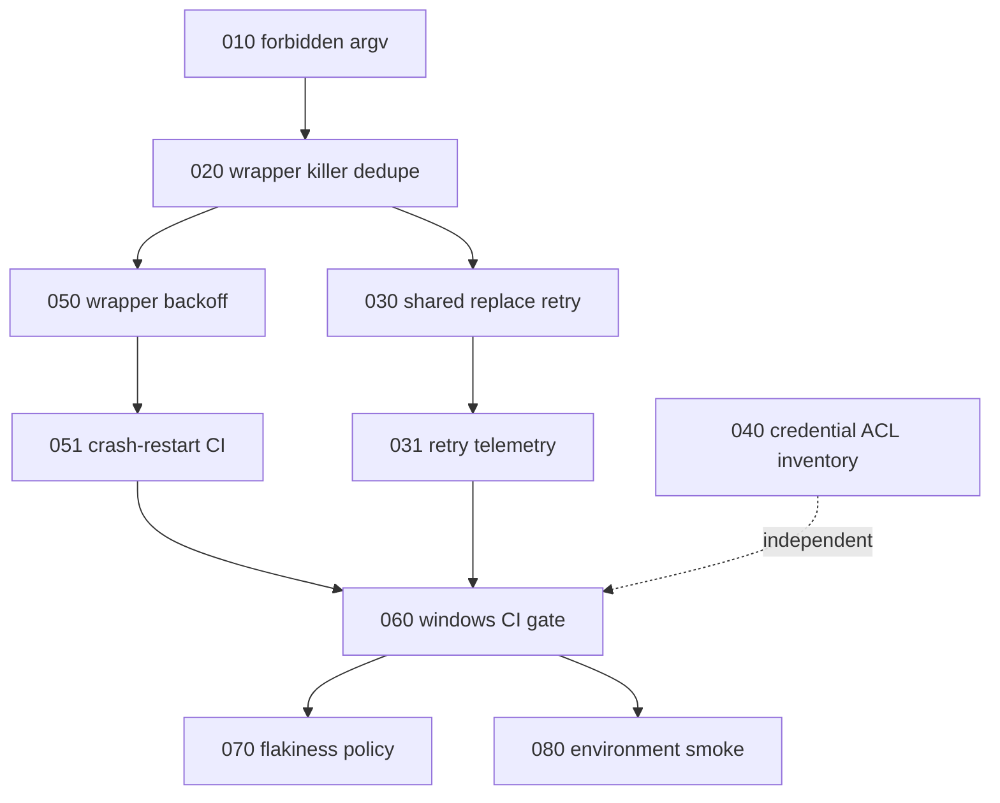

# 002 — Sequencing and what this unit deliberately does not do

## Order

The dependencies are real, not tidiness. 010 before 020 because the fix lands in
the copy that 020 deletes. 050 before 051 because there is no point testing a
loop that is about to change. Everything before 060 because a gate armed over
known-red is a gate that gets disarmed.

040 is independent and can run any time; it produces a document, not a patch.

## Out of scope for this unit

**The synchronous-subprocess latency class.** Both P1 and P3 rank
`icacls`/PowerShell-CIM on the request path as the top runtime problem
(#1852, #1298, PR #1876), and their reasoning is convincing. It is excluded here
because this session measured nothing — no latency numbers, no event-loop
traces. Carrying it in would put an unverified claim next to seven verified
ones and devalue all of them. It is recorded at the end of `001` so the next
cycle inherits it instead of rediscovering it. Its natural home is #1876.

**Update transactionality.** #1849 is open and the design work (stage outside
the live tree, verify, switch, retire the backup) is larger than any phase here.
Separate unit.

## Definition of done for the unit

- 010-051 landed with their guards driven red first.
- 060 through stage 4, so a release cannot publish on a run where Windows
  silently skipped.
- 070's nightly running and its quarantine list open and reviewed.
- 080 items landed individually or explicitly recorded as not achievable.
- 040's table complete, with any live exposure handled in scratch per AGENTS.md.

Until 060 stage 4 is done, every other phase in this unit is one merge away from
regressing. That is the point of the unit.
