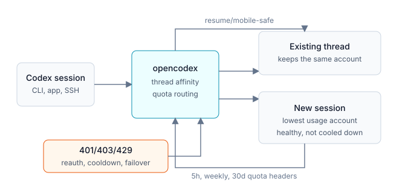

import { Steps } from '@astrojs/starlight/components';

Codex, OpenAI **Responses API** protokolü ile iletişim kurar. opencodex, Server-Sent Events (SSE) ile HTTP üzerinden `POST /v1/responses` isteklerini ve aynı yol üzerinde isteğe bağlı bir WebSocket bağlantısını kabul eder. İsteği sağlayıcınızın protokol formatına ve dönen yanıtı tekrar Responses etkinliklerine çevirir — böylece Codex OpenAI ile konuşmadığının farkına bile varmaz.

```
            ┌──────────────────────────── opencodex ────────────────────────────┐
            │                                                                     │
 Codex ──▶  │  ayrıştırıcı ──▶ yönlendirici ──▶ [vision] ──▶ adaptör ──▶ sağlayıcı│  ──▶ Codex
 (/v1/      │     │                 │              │            │           │     │   (SSE / WS)
  responses)│   OcxParsed       sağlayıcı       görselleri   buildRequest parseStream│
            │   Request         +adaptör        açıkla        + fetch     AdapterEvent[]
            │                                                       │           │     │
            │                                              [web-search döngüsü] köprü ─▶ SSE
            └─────────────────────────────────────────────────────────────────────┘
```



## Codex Kimlik Doğrulama Hesap Seçimi

Seçilen sağlayıcı ChatGPT/Codex doğrudan geçişi olduğunda opencodex, istek üst sağlayıcıya iletilmeden önce havuzdaki kayıtlı bir hesabı seçebilir. Kural iki ana duruma ayrılır:

- **Mevcut iş parçacıkları (thread) bağlılığını korur.** Bir iş parçacığı onu başlatan hesap jenerasyonuna bağlanır; böylece uzun bir SSH, tmux veya mobil bağlantılı Codex oturumu konuşma ortasında yeniden dengelenmek yerine tek bir hesabı kullanmaya devam eder.
- **Yeni oturumlar yeniden dengelenebilir.** Yeni bir oturum açıldığında opencodex, `accountPoolStrategy` (varsayılan olarak `quota`; desteklenen diğer stratejiler: `round-robin` veya `fill-first`) kullanarak uygun hesaplar arasından seçim yapar. `quota` stratejisi 5 saatlik, haftalık ve 30 günlük pencerelerdeki kullanım durumunu karşılaştırır ve aktif hesap `autoSwitchThreshold` sınırını aştığında daha az kullanılan bir hesaba geçebilir. Bekleme süresinde (cooldown) olan veya yeniden kimlik doğrulaması gereken hesaplar stratejiden bağımsız olarak atlanır.
- **Kota ve hata sinyalleri yönlendirmeyi besler.** Kontrol paneli `GET /api/codex-auth/accounts?refresh=1` ile kota yenilemesini zorlayabilir; başarılı yanıtlar kota başlıklarını kaydeder, 429 hatası hesabı bekleme moduna alır ve 401/403 hesabı yeniden doğrulanacak şekilde işaretler.

## Alt Ajan Model Seçimi

Temiz bir kurulumda `subagentModels`, Codex'in alt ajan seçicisinde `gpt-5.5`, GPT-5.6 Sol/Terra/Luna üçlüsü ve `gpt-5.4-mini` modellerini sunar. Kontrol paneli üzerinden en fazla beş girdi yerel veya yönlendirilmiş modellerle değiştirilebilir ya da yeniden sıralanabilir. v1 iş birliği istekleri için isteğe bağlı `injectionModel` ve `injectionEffort` ayarları, `spawn_agent`'a hangi model ve akıl yürütme seviyesini kullanacağını belirten geliştirici yönlendirmesi ekler; v2 istekleri ise Codex'in yerel çoklu ajan yönlendirmesini korur.

## İstek Yaşam Döngüsü

<Steps>

1. **Ayrıştırma (Parse)** — `responses/parser.ts`, Zod şemasıyla (`responses/schema.ts`) gelen isteği doğrular ve dahili bir `OcxParsedRequest` nesnesine dönüştürür: sistem istemi (system prompt), normalize edilmiş mesaj listesi (metin, görseller, araç çağrıları, araç sonuçları), araç tanımları, üretim seçenekleri ve `_webSearch` (barındırılan web araması), `_structuredOutput` (JSON şema / formatı) gibi özellik bayrakları. Görseller gerçek içerik parçaları olarak korunur — asla base64 metne dönüştürülüp satır içine gömülmez.

2. **Yönlendirme (Route)** — `router.ts`, istenen model kimliğini belirli bir öncelik sırasına göre yapılandırılmış bir sağlayıcıya eşler: açık `sağlayıcı/model` formatı → sağlayıcının `defaultModel` değeri → yerleşik önek kalıpları (`claude-`, `gpt-`, `o1-`/`o3-`/`o4-`, `llama-`/`mixtral-`/`gemma-`) → sağlayıcının `models[]` listesi → `defaultProvider` yedek seçeneği. Detaylar için [Model Yönlendirme](/tr/guides/model-routing/) sayfasına bakın.

3. **Kimlik Doğrulama (Authenticate)** — Bir `oauth` sağlayıcısı için opencodex, otomatik yenilenen taze bir erişim belirtecini (access token) bearer anahtarı olarak kullanır; böylece mevcut adaptörler aynen çalışır. ChatGPT/Codex havuz hesapları için `codex/auth-context.ts` önce hesabı çözer; gerekli havuz kimlik bilgisi bulunamazsa doğrudan geçiş adaptörü işlemi durdurur.

4. **Görme Sidecar'ı (İsteğe Bağlı - Vision Sidecar)** — Yönlendirilen model `provider.noVisionModels` listesinde yer alıyorsa ve istek bir görsel içeriyorsa, opencodex yapılandırılan ChatGPT vision sidecar'ı ile her görseli açıklar ve metinle değiştirir; böylece yalnızca metin destekleyen bir model de görsel hakkında akıl yürütebilir. Bkz: [Sidecar'lar](/guides/sidecars/).

5. **Doğrudan Geçiş Hızlı Yolu (Passthrough Fast Path)** — Adaptör bir Responses doğrudan geçişi ise (`openai-responses` veya `azure-openai`), opencodex Responses gövdesini korur, hedeflenen yönlendirme ve uyumluluk yeniden yazımlarını uygular ve ardından sağlayıcının yanıtını `AdapterEvent` nesnelerine dönüştürmeden doğrudan iletir.

6. **Web Arama Sidecar'ı (İsteğe Bağlı - Web-search Sidecar)** — Codex barındırılan `web_search` özelliğini etkinleştirdiyse ancak yönlendirilen model OpenAI harici bir modelse, opencodex sentetik bir `web_search` fonksiyon aracı sunar ve modeli küçük bir ajan döngüsünde çalıştırır; ChatGPT oturumunuz üzerinden varsayılan olarak `gpt-5.6-luna` ile gerçek aramalar yapar ve sonuçları araç sonucu olarak geri iletir.

7. **Sıkıştırma (İstendiğinde - Compact)** — Codex v1 `POST /v1/responses/compact` çağrısı yapar; v2 ise Responses turuna bir `compaction_trigger` ekler. Yerel doğrudan geçiş sıkıştırmayı üst sağlayıcıya yönlendirirken, yönlendirilen model araçsız bir özetleyici olarak çalışır ve Codex'in beklediği geçmiş biçimini döndürür.

8. **Uyarlama (Adapt)** — Aksi takdirde seçilen adaptörün `buildRequest()` fonksiyonu, sağlayıcının yerel formatında HTTP isteğini (URL, başlıklar, gövde) oluşturur ve opencodex bu isteği `fetch` eder.

9. **Köprüleme (Bridge)** — Adaptörün `parseStream()` (veya `parseResponse()`) fonksiyonu dahili `AdapterEvent` olaylarını (metin, akıl yürütme, araç çağrısı başlangıç/delta/bitiş, tamamlandı, hata) üretir. `bridge.ts` bu akışı tekrar Responses SSE etkinliklerine dönüştürür — `response.output_text.delta`, `response.reasoning_summary_text.delta`, `response.function_call_arguments.delta`, `response.completed` vb. İsteğe bağlı WebSocket taşıması aynı olay yüklerini metin çerçeveleri (text frames) olarak gönderir.

</Steps>

## Neden bir Codex çatalı (fork) değil de proxy?

Codex, Responses API'sini sabit kodlamıştır. opencodex protokol sınırında dönüşüm yaparak Codex **CLI, App ve SDK** ile değişiklik yapmadan çalışır, Codex güncellemelerinden etkilenmez ve Codex'in kendisine dokunmadan istek bazında sağlayıcı değiştirmenize olanak tanır. Dönüşüm iki yönlüdür ve akış doğruluğunu korur: akıl yürütme özetleri, MCP araç ad alanları, serbest biçimli (`apply_patch`) araçlar ve `tool_search` keşifleri eksiksiz bir şekilde gidiş-dönüş yapar. Olay bazında eşleme için [Mimari Referansı](/reference/architecture/) bölümüne bakabilirsiniz.
